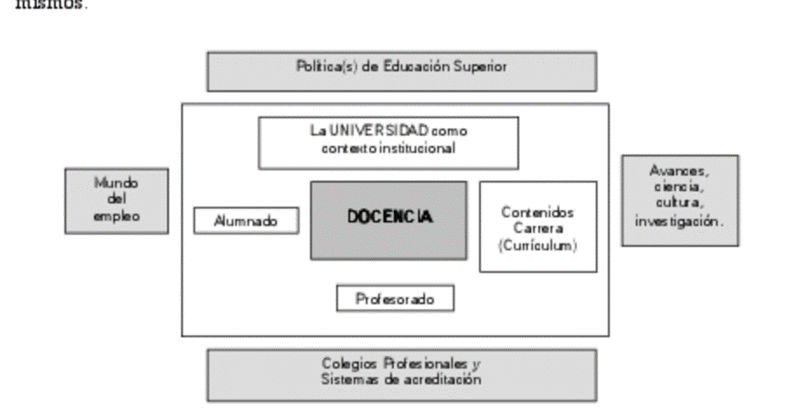

```{r setup, include=FALSE}

knitr::opts_chunk$set(echo = FALSE, warning = FALSE, message = FALSE, fig.align="center",out.width="95%", cache=FALSE)
# load R packages

library("extrafont")
library(knitr)
library(kableExtra)
library(formattable)
library(dplyr)

```


# Introducción 

Esta es una plantilla de uso general en la que se puede incluir cualquier tipo de reporte. Se pueden poner enlaces, por ejemplo [tufte-latex](https://github.com/tufte-latex/tufte-latex) y [tufte-css](https://github.com/edwardtufte/tufte-css)]. 

## Imágenes

La plantilla está pensada para poder trabajar con imágenes en eps png y pdf (solo pdf output). Vemos un ejemplo en la figura \ref{figura01}

```{r ejemplo, out.width="50%", fig.width=3, height=3, fig.cap="\\label{figura01} Contextualización de la docencia universitaria. Adaptado de Zabalza (2002)"}



```

### Citas

Podemos meter este formato para las citas

\noindent\rule{2cm}{0.4pt}

> Unidad de medida del haber académico que representa la cantidad de trabajo del estudiante para cumplir los objetivos del programa de estudios y que se obtiene por la superación de cada una de las materias que integran los planes de estudios universitarios de carácter oficial y de validez en todo el territorio nacional.

> En esta unidad de medida se integran las enseñanzas teóricas y prácticas, así como otras actividades académicas dirigidas con inclusión de las horas de estudio y trabajo que el estudiante debe realizar para alcanzar los objetivos formativos propios de cada una de las materias. 

\noindent\rule{2cm}{0.4pt}

# Tablas

las tablas con kableExtra solo se pueden meter en el pdf o en el html


This style provides first and second-level headings (that is, `#` and `##`), demonstrated in the next section. You may get unexpected output if you try to use `###` and smaller headings.

```{r}
knitr::kable(
  mtcars[1:6, 1:6], caption = 'A subset of mtcars.'
)
```

```{r}


knitr::kable(
  mtcars[1:6, 1:6], caption = 'A subset of mtcars.'
)
```


## Tablas solo en el pdf

Las tablas con Kable Extra solo salen bien en el pdf, hay que cambiar la opción si queremos que salgan en el html y habría que usar solo kable para el documento word y luego editarlas desde allí.

```{r}
dt <- mtcars[1:5, 1:6]

kable(dt, format = "latex", booktabs = T) %>%
kable_styling(latex_options = "striped")
```

```{r}
kable(cbind(dt, dt, dt), format = "latex", booktabs = T) %>%
kable_styling(latex_options = c("striped", "scale_down"))
```

```{r}
long_dt <- rbind(mtcars, mtcars)

kable(long_dt, format = "latex", longtable = T, booktabs = T, caption = "Longtable") %>%
add_header_above(c(" ", "Group 1" = 5, "Group 2" = 6)) %>%
kable_styling(latex_options = c("repeat_header"))

```


