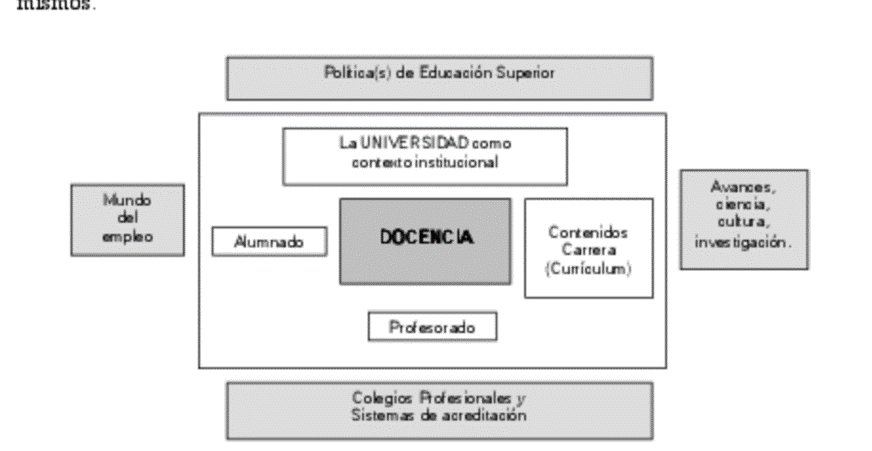

# Introducción 

Esta es una plantilla de uso general en la que se puede incluir cualquier tipo de reporte. Se pueden poner enlaces, por ejemplo [tufte-latex](https://github.com/tufte-latex/tufte-latex) y [tufte-css](https://github.com/edwardtufte/tufte-css)]. 

## Imágenes

La plantilla está pensada para poder trabajar con imágenes en eps png y pdf (solo pdf output). Vemos un ejemplo en la figura \ref{figura01}

\label{figura01} Contextualización de la docencia universitaria. Adaptado de Zabalza (2002)

### Citas

Podemos meter este formato para las citas

\noindent\rule{2cm}{0.4pt}

> Unidad de medida del haber académico que representa la cantidad de trabajo del estudiante para cumplir los objetivos del programa de estudios y que se obtiene por la superación de cada una de las materias que integran los planes de estudios universitarios de carácter oficial y de validez en todo el territorio nacional.

> En esta unidad de medida se integran las enseñanzas teóricas y prácticas, así como otras actividades académicas dirigidas con inclusión de las horas de estudio y trabajo que el estudiante debe realizar para alcanzar los objetivos formativos propios de cada una de las materias. 

\noindent\rule{2cm}{0.4pt}

# Tablas

This style provides first and second-level headings (that is, `#` and `##`), demonstrated in the next section. You may get unexpected output if you try to use `###` and smaller headings.

Table: A subset of mtcars.

                      mpg   cyl   disp    hp   drat      wt
------------------  -----  ----  -----  ----  -----  ------
Mazda RX4            21.0     6    160   110   3.90   2.620
Mazda RX4 Wag        21.0     6    160   110   3.90   2.875
Datsun 710           22.8     4    108    93   3.85   2.320
Hornet 4 Drive       21.4     6    258   110   3.08   3.215
Hornet Sportabout    18.7     8    360   175   3.15   3.440
Valiant              18.1     6    225   105   2.76   3.460

Table: A subset of mtcars.

                      mpg   cyl   disp    hp   drat      wt
------------------  -----  ----  -----  ----  -----  ------
Mazda RX4            21.0     6    160   110   3.90   2.620
Mazda RX4 Wag        21.0     6    160   110   3.90   2.875
Datsun 710           22.8     4    108    93   3.85   2.320
Hornet 4 Drive       21.4     6    258   110   3.08   3.215
Hornet Sportabout    18.7     8    360   175   3.15   3.440
Valiant              18.1     6    225   105   2.76   3.460

\begin{table}[H]
\centering\rowcolors{2}{gray!6}{white}

\begin{tabular}{lrrrrrr}
\hiderowcolors
\toprule
  & mpg & cyl & disp & hp & drat & wt\\
\midrule
\showrowcolors
Mazda RX4 & 21.0 & 6 & 160 & 110 & 3.90 & 2.620\\
Mazda RX4 Wag & 21.0 & 6 & 160 & 110 & 3.90 & 2.875\\
Datsun 710 & 22.8 & 4 & 108 & 93 & 3.85 & 2.320\\
Hornet 4 Drive & 21.4 & 6 & 258 & 110 & 3.08 & 3.215\\
Hornet Sportabout & 18.7 & 8 & 360 & 175 & 3.15 & 3.440\\
\bottomrule
\end{tabular}
\rowcolors{2}{white}{white}
\end{table}

\begin{table}[H]
\centering\rowcolors{2}{gray!6}{white}

\resizebox{\linewidth}{!}{\begin{tabular}{lrrrrrrrrrrrrrrrrrr}
\hiderowcolors
\toprule
  & mpg & cyl & disp & hp & drat & wt & mpg & cyl & disp & hp & drat & wt & mpg & cyl & disp & hp & drat & wt\\
\midrule
\showrowcolors
Mazda RX4 & 21.0 & 6 & 160 & 110 & 3.90 & 2.620 & 21.0 & 6 & 160 & 110 & 3.90 & 2.620 & 21.0 & 6 & 160 & 110 & 3.90 & 2.620\\
Mazda RX4 Wag & 21.0 & 6 & 160 & 110 & 3.90 & 2.875 & 21.0 & 6 & 160 & 110 & 3.90 & 2.875 & 21.0 & 6 & 160 & 110 & 3.90 & 2.875\\
Datsun 710 & 22.8 & 4 & 108 & 93 & 3.85 & 2.320 & 22.8 & 4 & 108 & 93 & 3.85 & 2.320 & 22.8 & 4 & 108 & 93 & 3.85 & 2.320\\
Hornet 4 Drive & 21.4 & 6 & 258 & 110 & 3.08 & 3.215 & 21.4 & 6 & 258 & 110 & 3.08 & 3.215 & 21.4 & 6 & 258 & 110 & 3.08 & 3.215\\
Hornet Sportabout & 18.7 & 8 & 360 & 175 & 3.15 & 3.440 & 18.7 & 8 & 360 & 175 & 3.15 & 3.440 & 18.7 & 8 & 360 & 175 & 3.15 & 3.440\\
\bottomrule
\end{tabular}}
\rowcolors{2}{white}{white}
\end{table}

\begin{longtable}[t]{lrrrrrrrrrrr}
\caption{\label{tab:unnamed-chunk-2}Longtable}\\
\toprule
\multicolumn{1}{c}{ } & \multicolumn{5}{c}{Group 1} & \multicolumn{6}{c}{Group 2} \\
\cmidrule(l{2pt}r{2pt}){2-6} \cmidrule(l{2pt}r{2pt}){7-12}
  & mpg & cyl & disp & hp & drat & wt & qsec & vs & am & gear & carb\\
\midrule
\endfirsthead
\caption[]{Longtable \textit{(continued)}}\\
\toprule
\multicolumn{1}{c}{ } & \multicolumn{5}{c}{Group 1} & \multicolumn{6}{c}{Group 2} \\
\cmidrule(l{2pt}r{2pt}){2-6} \cmidrule(l{2pt}r{2pt}){7-12}
  & mpg & cyl & disp & hp & drat & wt & qsec & vs & am & gear & carb\\
\midrule
\endhead
\
\endfoot
\bottomrule
\endlastfoot
Mazda RX4 & 21.0 & 6 & 160.0 & 110 & 3.90 & 2.620 & 16.46 & 0 & 1 & 4 & 4\\
Mazda RX4 Wag & 21.0 & 6 & 160.0 & 110 & 3.90 & 2.875 & 17.02 & 0 & 1 & 4 & 4\\
Datsun 710 & 22.8 & 4 & 108.0 & 93 & 3.85 & 2.320 & 18.61 & 1 & 1 & 4 & 1\\
Hornet 4 Drive & 21.4 & 6 & 258.0 & 110 & 3.08 & 3.215 & 19.44 & 1 & 0 & 3 & 1\\
Hornet Sportabout & 18.7 & 8 & 360.0 & 175 & 3.15 & 3.440 & 17.02 & 0 & 0 & 3 & 2\\
\addlinespace
Valiant & 18.1 & 6 & 225.0 & 105 & 2.76 & 3.460 & 20.22 & 1 & 0 & 3 & 1\\
Duster 360 & 14.3 & 8 & 360.0 & 245 & 3.21 & 3.570 & 15.84 & 0 & 0 & 3 & 4\\
Merc 240D & 24.4 & 4 & 146.7 & 62 & 3.69 & 3.190 & 20.00 & 1 & 0 & 4 & 2\\
Merc 230 & 22.8 & 4 & 140.8 & 95 & 3.92 & 3.150 & 22.90 & 1 & 0 & 4 & 2\\
Merc 280 & 19.2 & 6 & 167.6 & 123 & 3.92 & 3.440 & 18.30 & 1 & 0 & 4 & 4\\
\addlinespace
Merc 280C & 17.8 & 6 & 167.6 & 123 & 3.92 & 3.440 & 18.90 & 1 & 0 & 4 & 4\\
Merc 450SE & 16.4 & 8 & 275.8 & 180 & 3.07 & 4.070 & 17.40 & 0 & 0 & 3 & 3\\
Merc 450SL & 17.3 & 8 & 275.8 & 180 & 3.07 & 3.730 & 17.60 & 0 & 0 & 3 & 3\\
Merc 450SLC & 15.2 & 8 & 275.8 & 180 & 3.07 & 3.780 & 18.00 & 0 & 0 & 3 & 3\\
Cadillac Fleetwood & 10.4 & 8 & 472.0 & 205 & 2.93 & 5.250 & 17.98 & 0 & 0 & 3 & 4\\
\addlinespace
Lincoln Continental & 10.4 & 8 & 460.0 & 215 & 3.00 & 5.424 & 17.82 & 0 & 0 & 3 & 4\\
Chrysler Imperial & 14.7 & 8 & 440.0 & 230 & 3.23 & 5.345 & 17.42 & 0 & 0 & 3 & 4\\
Fiat 128 & 32.4 & 4 & 78.7 & 66 & 4.08 & 2.200 & 19.47 & 1 & 1 & 4 & 1\\
Honda Civic & 30.4 & 4 & 75.7 & 52 & 4.93 & 1.615 & 18.52 & 1 & 1 & 4 & 2\\
Toyota Corolla & 33.9 & 4 & 71.1 & 65 & 4.22 & 1.835 & 19.90 & 1 & 1 & 4 & 1\\
\addlinespace
Toyota Corona & 21.5 & 4 & 120.1 & 97 & 3.70 & 2.465 & 20.01 & 1 & 0 & 3 & 1\\
Dodge Challenger & 15.5 & 8 & 318.0 & 150 & 2.76 & 3.520 & 16.87 & 0 & 0 & 3 & 2\\
AMC Javelin & 15.2 & 8 & 304.0 & 150 & 3.15 & 3.435 & 17.30 & 0 & 0 & 3 & 2\\
Camaro Z28 & 13.3 & 8 & 350.0 & 245 & 3.73 & 3.840 & 15.41 & 0 & 0 & 3 & 4\\
Pontiac Firebird & 19.2 & 8 & 400.0 & 175 & 3.08 & 3.845 & 17.05 & 0 & 0 & 3 & 2\\
\addlinespace
Fiat X1-9 & 27.3 & 4 & 79.0 & 66 & 4.08 & 1.935 & 18.90 & 1 & 1 & 4 & 1\\
Porsche 914-2 & 26.0 & 4 & 120.3 & 91 & 4.43 & 2.140 & 16.70 & 0 & 1 & 5 & 2\\
Lotus Europa & 30.4 & 4 & 95.1 & 113 & 3.77 & 1.513 & 16.90 & 1 & 1 & 5 & 2\\
Ford Pantera L & 15.8 & 8 & 351.0 & 264 & 4.22 & 3.170 & 14.50 & 0 & 1 & 5 & 4\\
Ferrari Dino & 19.7 & 6 & 145.0 & 175 & 3.62 & 2.770 & 15.50 & 0 & 1 & 5 & 6\\
\addlinespace
Maserati Bora & 15.0 & 8 & 301.0 & 335 & 3.54 & 3.570 & 14.60 & 0 & 1 & 5 & 8\\
Volvo 142E & 21.4 & 4 & 121.0 & 109 & 4.11 & 2.780 & 18.60 & 1 & 1 & 4 & 2\\
Mazda RX41 & 21.0 & 6 & 160.0 & 110 & 3.90 & 2.620 & 16.46 & 0 & 1 & 4 & 4\\
Mazda RX4 Wag1 & 21.0 & 6 & 160.0 & 110 & 3.90 & 2.875 & 17.02 & 0 & 1 & 4 & 4\\
Datsun 7101 & 22.8 & 4 & 108.0 & 93 & 3.85 & 2.320 & 18.61 & 1 & 1 & 4 & 1\\
\addlinespace
Hornet 4 Drive1 & 21.4 & 6 & 258.0 & 110 & 3.08 & 3.215 & 19.44 & 1 & 0 & 3 & 1\\
Hornet Sportabout1 & 18.7 & 8 & 360.0 & 175 & 3.15 & 3.440 & 17.02 & 0 & 0 & 3 & 2\\
Valiant1 & 18.1 & 6 & 225.0 & 105 & 2.76 & 3.460 & 20.22 & 1 & 0 & 3 & 1\\
Duster 3601 & 14.3 & 8 & 360.0 & 245 & 3.21 & 3.570 & 15.84 & 0 & 0 & 3 & 4\\
Merc 240D1 & 24.4 & 4 & 146.7 & 62 & 3.69 & 3.190 & 20.00 & 1 & 0 & 4 & 2\\
\addlinespace
Merc 2301 & 22.8 & 4 & 140.8 & 95 & 3.92 & 3.150 & 22.90 & 1 & 0 & 4 & 2\\
Merc 2801 & 19.2 & 6 & 167.6 & 123 & 3.92 & 3.440 & 18.30 & 1 & 0 & 4 & 4\\
Merc 280C1 & 17.8 & 6 & 167.6 & 123 & 3.92 & 3.440 & 18.90 & 1 & 0 & 4 & 4\\
Merc 450SE1 & 16.4 & 8 & 275.8 & 180 & 3.07 & 4.070 & 17.40 & 0 & 0 & 3 & 3\\
Merc 450SL1 & 17.3 & 8 & 275.8 & 180 & 3.07 & 3.730 & 17.60 & 0 & 0 & 3 & 3\\
\addlinespace
Merc 450SLC1 & 15.2 & 8 & 275.8 & 180 & 3.07 & 3.780 & 18.00 & 0 & 0 & 3 & 3\\
Cadillac Fleetwood1 & 10.4 & 8 & 472.0 & 205 & 2.93 & 5.250 & 17.98 & 0 & 0 & 3 & 4\\
Lincoln Continental1 & 10.4 & 8 & 460.0 & 215 & 3.00 & 5.424 & 17.82 & 0 & 0 & 3 & 4\\
Chrysler Imperial1 & 14.7 & 8 & 440.0 & 230 & 3.23 & 5.345 & 17.42 & 0 & 0 & 3 & 4\\
Fiat 1281 & 32.4 & 4 & 78.7 & 66 & 4.08 & 2.200 & 19.47 & 1 & 1 & 4 & 1\\
\addlinespace
Honda Civic1 & 30.4 & 4 & 75.7 & 52 & 4.93 & 1.615 & 18.52 & 1 & 1 & 4 & 2\\
Toyota Corolla1 & 33.9 & 4 & 71.1 & 65 & 4.22 & 1.835 & 19.90 & 1 & 1 & 4 & 1\\
Toyota Corona1 & 21.5 & 4 & 120.1 & 97 & 3.70 & 2.465 & 20.01 & 1 & 0 & 3 & 1\\
Dodge Challenger1 & 15.5 & 8 & 318.0 & 150 & 2.76 & 3.520 & 16.87 & 0 & 0 & 3 & 2\\
AMC Javelin1 & 15.2 & 8 & 304.0 & 150 & 3.15 & 3.435 & 17.30 & 0 & 0 & 3 & 2\\
\addlinespace
Camaro Z281 & 13.3 & 8 & 350.0 & 245 & 3.73 & 3.840 & 15.41 & 0 & 0 & 3 & 4\\
Pontiac Firebird1 & 19.2 & 8 & 400.0 & 175 & 3.08 & 3.845 & 17.05 & 0 & 0 & 3 & 2\\
Fiat X1-91 & 27.3 & 4 & 79.0 & 66 & 4.08 & 1.935 & 18.90 & 1 & 1 & 4 & 1\\
Porsche 914-21 & 26.0 & 4 & 120.3 & 91 & 4.43 & 2.140 & 16.70 & 0 & 1 & 5 & 2\\
Lotus Europa1 & 30.4 & 4 & 95.1 & 113 & 3.77 & 1.513 & 16.90 & 1 & 1 & 5 & 2\\
\addlinespace
Ford Pantera L1 & 15.8 & 8 & 351.0 & 264 & 4.22 & 3.170 & 14.50 & 0 & 1 & 5 & 4\\
Ferrari Dino1 & 19.7 & 6 & 145.0 & 175 & 3.62 & 2.770 & 15.50 & 0 & 1 & 5 & 6\\
Maserati Bora1 & 15.0 & 8 & 301.0 & 335 & 3.54 & 3.570 & 14.60 & 0 & 1 & 5 & 8\\
Volvo 142E1 & 21.4 & 4 & 121.0 & 109 & 4.11 & 2.780 & 18.60 & 1 & 1 & 4 & 2\\*
\end{longtable}

